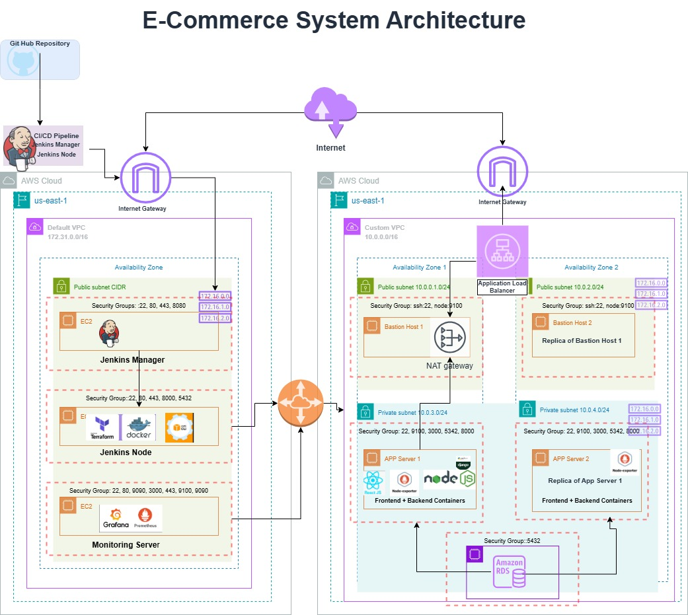
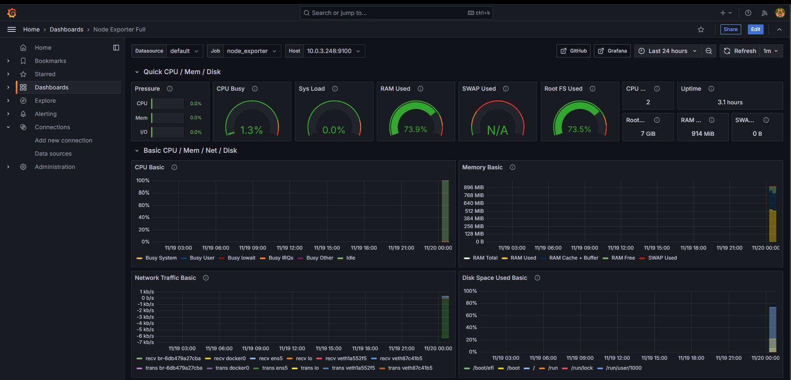

# E-commerce Application Deployment with Docker and Terraform

## Requirements
The E-commerce company now wants to containerize their application before deploying it to AWS Cloud which is secure, available, and fault-tolerant. They also want to utilize Infrastructure as code as well as a CICD pipeline to be able to spin up or modify infrastructure as needed whenever an update 
is made to the application code.


## Purpose
This workload demonstrates the deployment of an application using containerization and Infrastructure as Code (IaC). The primary goals are:
- Implementing a maintainable deployment strategy using Docker containers
- Automate infrastructure provisioning with Terraform
- Set up a CI/CD pipeline with Jenkins
- Create a highly available architecture across multiple availability zones
- Ensure secure networking with proper isolation of components


## Infrastructure Overview
The infrastructure consists of:
- **VPC Configuration**:
  - Custom VPC in us-east-1
  - 2 Availability Zones (us-east-1a, us-east-1b)
  - Public and private subnets in each AZ
  - Internet Gateway for public access
  - NAT Gateway for private subnet outbound traffic
  
- **Compute**:
  - Bastion hosts in public subnets for secure access
  - Application servers in private subnets
  - Application Load balancer distributing traffic across AZs

- **Database**:
  - RDS PostgreSQL instance in a private subnet
  - Automated backups and maintenance

- **Security**:
  - Security groups controlling access between components
  - Private subnets for application instances and database 
  
  - **Default VPC**
  - Default VPC in us-east-1
  - 1 availability zone
  - Public subnet
  - EC2 Servers for the Jenkins Manager, Jenkins Node, and Monitoring Server




### Key Components:
**VPC Layout**
- Default VPC containing Jenkins and Monitoring infrastructure
- Frontend + Backend containers in custom VPC with multi-AZ deployment
- VPC Peering connection

**Container Architecture**
- Frontend Container (Node.js)
- Backend Container (Django)

**Network Flow**
- Application Load balancer traffic distribution
- Bastion host access paths
- Monitoring data collection


## Overview of Requirements 
### 1. Environment Setup 
- Create a Jenkins Manager (t3.micro) and Docker/Terraform Jenkins Node (t3.medium) instances
- Required tools: Java 17, Jenkins, Docker, Terraform, AWS CLI (STEPS HERE)
- Configure the Jenkins node agent for distributed builds (STEPS HERE)
- **Importance**: Lays the foundation for our automated CI/CD pipeline

### 2. Infrastructure as Code
- Create Terraform configuration files for infrastructure (for VPC, EC2, and RDS)
- Include "user_data" code for EC2 resource block
- Create deploy.sh script to run in "user_Data"
**Importance**: Makes infrastructure manageable and reusable


### 3. Containerization : 
- Create Dockerfiles for the backend (Python/Django), and frontend (Node.js)
- Implement multi-stage builds in Jenkins for optimization
- Set up Docker compose
- **Importance**: Ensures consistent environments

### 4. CI/CD Pipeline
- Configure Jenkins pipeline with relevant stages
  - Build
  - Test
  - Cleanup
  - Build & Push Images Stage
  - Terraform Plan Stages
  - Terraform Build Stage
  - Post-Build Actions
- **Importance**: Automates deployment process and ensures quality
 

## Implementation Steps
### 1. Jenkins Manager Instance (t3.micro)
The Jenkins Manager instance Acts as the central control plane for the entire CI/CD pipeline
Manages and orchestrates all pipeline jobs and workflows.

### Importance
**Pipeline Orchestration:**
- Is the single point of control, coordinating all stages of the build and deployment process
- Manages build queues and job scheduling
- Handles integrations with Git repositories

**Security:** 
- Acts as a secure gateway for all deployment operations
- Handles authentication and authorization
- Manages credentials and secrets
- Controls access to different pipeline components


### 2. Docker_Terraform (Jenkins Node Instance)

The Jenkins Node executes the actual build and handles deployment tasks.
It is important because it reduces the load on Jenkins master and enables parallel execution of multiple jobs.
In this deployment, it handles container operations and infrastructure provisioning.

**Benefits**
- Additional nodes can be added for increased capacity
- It isolates build tasks and deployment operations from management tasks
- It allows for the distribution of  builds across multiple nodes
- It also provides flexibility in the allocation of resources

Importance of the Key Components Configured on the Node instance.
**Docker** : For building containers
**Importance:** Ensures consistent environments and simplified deployment
Benefits:
- Is lightweight compared to traditional VMs
- It builds and tests container images independently, preventing conflicts
- Ensures identical environments across various environments (Development or production)

##JENKINS PIPELINE STAGES

**Importance**: Automates deployment process and ensures quality 
**Stages:**
(Jenkinsfile)
### . Build Stage
- Creates Python virtual environment
- Activates venv
- Upgrades pip
- Installs Python dependencies from backend/requirements.txt
- **Purpose**: Sets up the Python development environment for the application

### . Test Stage
- Uses the virtual environment from the Build stage
- Creates test-reports directory
- Installs pytest-django
- Runs Django migrations
- Executes pytest on account/tests.py
- **Purpose**: Tests the application to make sure it is functioning properly

### . Cleanup Stage
- Runs on build-node
- Performs Docker system cleanup (prune)
- Cleans git repository while preserving Terraform state
- **Purpose**: Maintains a clean environment by removing unused resources

### . Build & Push Images Stage
- Runs on build-node
- Logs into DockerHub using credentials
- Builds and pushes two Docker images:
  - ecommerce-backend
  - ecommerce-frontend
- **Purpose**: Creates containerized applications and pushes them to DockerHub

### . Terraform Plan Stage
- Runs on build-node
- Initializes Terraform
- Creates execution plan using the credential configured in Jenkins:
  - DockerHub credentials
  - Database password
- **Purpose**: Prepares and reviews configuration 

### . Terraform Apply Stage
- Runs on build-node
- Applies the Terraform plan
- **Purpose**: This stage deploys the infrastructure

### . Post-Build Actions
- **Always**: 
  - Logs out of Docker
  - Cleans Docker system
- **Success**: 
  - Confirms successful Terraform apply
- **Failure**: 
  - Destroys Terraform resources
  - Performs cleanup


## Terraform: For infrastructure as Code Deployment
Importance: Makes infrastructure reproducible and maintainable
Benefits:
- Provisions and manages AWS infrastructure
- Reduces manual configuration errors
- Handles state management and executes infrastructure changes
- The infrastructure components are reusable
- Manages resource dependencies
```
**TERRAFORM MODULE STUCTURE**
Terraform/
├── main.tf          
├── outputs.tf       
└── modules/
├── ec2/
│   ├── main.tf          
│   ├── outputs.tf       
│   ├── variables.tf     
│   ├── deploy.sh        
│   └── compose.yaml     
└── vpc/
├── main.tf          
├── outputs.tf       

```

### AWS CLI: For AWS resource management and authentication
- Interacts with AWS services
- Manages AWS resources and handles AWS authentication


## Containerization with Docker
**Implementation**
- Created Dockerfiles for backend (Python/Django), frontend (Node.js) (Dockefiles Backend and Frontend here)
- Implemented multi-stage builds for optimization
- Set up Docker Compose for local development and testing
- **Importance**: Ensures consistent environments and simplified deployment

## 4. CI/CD Pipeline
- Configured Jenkins pipeline with multiple stages:
  - Build: Compiles and packages application
  - Test: Runs automated tests
  - Cleanup: Removes unused resources
  - Image Building: Creates and pushes Docker images
  - Infrastructure: Applies Terraform configurations
- **Importance**: Automates deployment process and ensures quality


### Monitoring  
- Created an EC2 Instance in the Default VPC to monitor resources
- Configured Prometheus (STEPS HERE)
- Installed Grafana (STEPS HERE)
- Configured VPC peering for cross-VPC communication (STEPS HERE)
- Installed node exporter on application resources for metrics collection (STEPS HERE)
   


## Security Implementation
### Custom VPC Security
- Private subnets: Application and database servers
- Public subnets: Only bastion hosts and load balancers
- NAT Gateway: Controlled outbound access

### Default VPC Security
- Jenkins and Monitoring servers with restricted access
- VPC Peering with security group rules

###Jenkins Security
- Configured Authentication built-in
- Credentials Security implemented in the pipeline
- Credential Management for:
		- DockerHub
		- AWS
		- GitHub


### SSH Access
- Key-based authentication
- Bastion Host as a single point of entry
- No direct Access to private instances


### Container Security
- No hardcoded credentials
- No sensitive data in images or files
- Non-root user for application execution
- Use of latest base images (With security patches)


### Monitoring Security**
- Authentication Required
- Secure communication through VPC Peering
- Limited to  necessary metrics only
- Metrics collection is encrypted


## ISSUES/TROUBLESHOOTING
### Database Migration Issue
**PROBLEM**:
1. Products weren't showing up on the website
2. I discovered two main issues
    - Database migrations were running on both app_az1 and app_az2 servers causing conflicts
    - The original product data was in SQLite but needed to be in PostgreSQL RDS

INITIAL TROUBLESHOOTING:
1. Connected to app_az1 through bastion host:
2. Connected to app_az1 through bastion host:
3. Verified containers running: sudo docker ps
4. Checked backend container: sudo docker exec -it <backend-container-id> bash
5. Checked database connection from the python shell: 
			
			python manage.py shell
			>>> from django.db import connection
			>>> connection.ensure_connection()
			>>> connection.introspection.table_names()
 

**Solution**:
1. I found the original data in SQLite database
  ```
			from django.db import connections
			cursor = connections['sqlite'].cursor()
			cursor.execute("SELECT * FROM product_product")
			rows = cursor.fetchall()
```

2. Exported product data from SQLite with:
 ```
	python manage.py dumpdata --database=sqlite product.product > products.json
```

3. Imported data dump file from SQLite  into PostgreSQL RDS:
		```
		python manage.py loaddata products.json
   ```

**RESULT:**
- Successfully transferred 33 products
- Website now displays all products
- Data is properly stored in RDS database
- Both app servers can access the products


### KEY LEARNINGS:
1. When using multiple databases:
    - Be clear about which database holds the source data
      
2. For migrations:
    - Only run on one server when sharing a database
    - Or manually run migrations on one server
3. Database connections:
    - Verify connections before loading  data
    - Checking that the table exists doesn't mean that the data exists, make sure to verify
    - Use proper database credentials in settings.py


## Optimization 

### Infrastructure
- Implement auto-scaling groups 
- Implement cross-region redundancy
- Configure backup strategies for RDS

### Container Optimization
- Implement container health checks
- Add logging and monitoring solutions

### Security Enhancements
- Implement AWS WAF
- Add SSL/TLS encryption
- Alternative secret management


